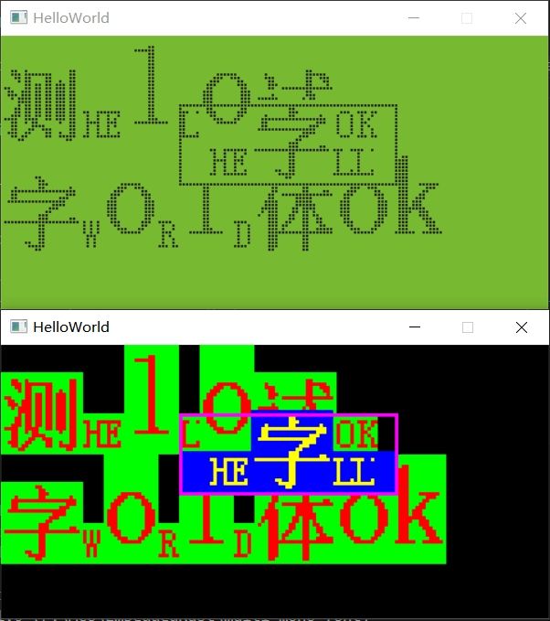

# Multi mono fon

## Introduction

Multi mono font mixed typesetting for embedded-graphics

This crate is modified based on [embedded-graphics MonoFonts](https://github.com/embedded-graphics/embedded-graphics/tree/master/src/mono_font) to add support for displaying different sizes of monospaced fonts within the same line/segment of text.

The strikethrough and underline have been removed from the original fonts, and some variable types have been changed to u8 (can be changed to u16 via features) to save storage space.

Check [examples/hello.rs](examples/hello.rs) for usage.
```
const MULTI_STYLE: MultiMonoTextStyle<Rgb565> = MultiMonoTextStyle::new(
    &[&UPPER_FONT, &HZ_FONT, &LOWER_FONT],
    MultiMonoLineHeight::Max,
    Rgb565::WHITE,
);

let _next = Text::new("测HElLo试OK\n", Point::new(0, 32), MULTI_STYLE)
	.draw(&mut disp)
	.unwrap();
let _next = Text::new("字WoRlD体ok", _next, MULTI_STYLE)
	.draw(&mut disp)
	.unwrap();
```


